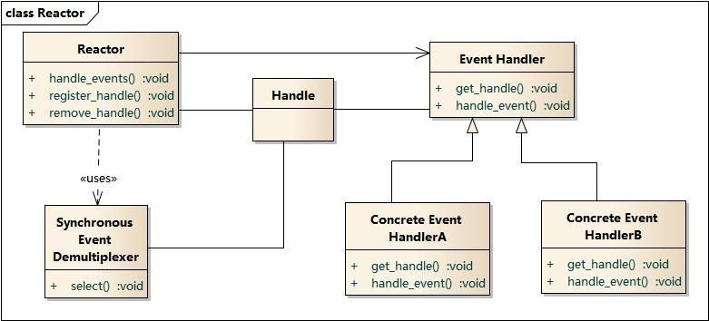

# 1. 异步调度

- [1. 异步调度](#1-异步调度)
  - [1.1. 异步设计模型](#11-异步设计模型)
    - [1.1.1. Reactor](#111-reactor)
    - [1.1.2. Proactor](#112-proactor)
  - [1.2. 常见I/O模型分类](#12-常见io模型分类)
    - [1.2.1. blocking I/O](#121-blocking-io)
    - [1.2.2. nonblocking I/O](#122-nonblocking-io)
    - [1.2.3. I/O multiplexing (select and poll)](#123-io-multiplexing-select-and-poll)
    - [1.2.4. signal driven I/O (SIGIO)](#124-signal-driven-io-sigio)
    - [1.2.5. asynchronous I/O (the POSIX aio_functions)](#125-asynchronous-io-the-posix-aio_functions)
  - [1.3. select/poll/epoll](#13-selectpollepoll)
    - [1.3.1. select](#131-select)
    - [1.3.2. poll](#132-poll)
    - [1.3.3. epoll](#133-epoll)
  - [1.4. IOCP](#14-iocp)
  - [1.5. kqueue](#15-kqueue)
  - [1.6. event ports](#16-event-ports)
  - [1.7. 参考资料](#17-参考资料)

## 1.1. 异步设计模型

&emsp;&emsp;在高性能的I/O设计中，有两个比较著名的模式 Reactor(反应器/电抗器/反应者) 和 Proactor(前摄器/主动器/前摄器模式/异步情况下) 模式，其中Reactor 模式用于同步I/O，而 Proactor 运用于异步I/O操作。

### 1.1.1. Reactor

Reactor模式结构



Reactor包含如下角色

- Handle 句柄；用来标识socket连接/文件句柄；
- Synchronous Event Demultiplexer：同步事件多路分解器：由操作系统内核实现的一个函数；用于阻塞等待发生在句柄集合上的一个或多个事件；（如select/epoll；）
- Event Handler：事件处理接口
- Concrete Event HandlerA：实现应用程序所提供的特定事件处理逻辑；
- Reactor：反应器，定义一个接口，实现以下功能：
  - 供应用程序注册和删除关注的事件句柄；
  - 运行事件循环；
  - 有就绪事件到来时，分发事件到之前注册的回调函数上处理；

“反应”器名字中”反应“的由来：“反应”即“倒置”，“控制逆转”

具体事件处理程序不调用反应器，而是由反应器分配一个具体事件处理程序，具体事件处理程序对某个指定的事件发生做出反应；这种控制逆转又称为“好莱坞法则”（不要调用我，让我来调用你）

业务流程及时序图


- 应用启动，将关注的事件handle注册到Reactor中；
- 调用Reactor，进入无限事件循环，等待注册的事件到来；
- 事件到来，select返回，Reactor将事件分发到之前注册的回调函数中处理；

### 1.1.2. Proactor

Proactor 模式结构


Proactor主动器模式包含如下角色

- Handle 句柄；用来标识socket连接/文件句柄；
- Asynchronous Operation Processor：异步操作处理器；负责执行异步操作，一般由操作系统内核实现；用户delegate(委托)其处理，Reactor模式中没有这个角色
- Asynchronous Operation：异步操作
- Completion Event Queue：完成事件队列；异步操作完成的结果放到队列中等待后续使用
- Proactor：主动器；为应用程序进程提供事件循环；从完成事件队列中取出异步操作的结果，分发调用相应的后续处理逻辑；
- Completion Handler：完成事件接口；一般是由回调函数组成的接口；
- Concrete Completion Handler：完成事件处理逻辑；实现接口定义特定的应用处理逻辑；

业务流程及时序图


- 应用程序启动，调用异步操作处理器提供的异步操作接口函数，调用之后应用程序和异步操作处理就独立运行；应用程序可以调用新的异步操作，而其它操作可以并发进行；
- 应用程序启动Proactor主动器，进行无限的事件循环，等待完成事件到来；
- 异步操作处理器执行异步操作，完成后将结果放入到完成事件队列；
- 主动器从完成事件队列中取出结果，分发到相应的完成事件回调函数处理逻辑中；

## 1.2. 常见I/O模型分类

- A synchronous I/O operation causes the requesting process to be blocked until that I/O operation completes;
- An asynchronous I/O operation does not cause the requesting process to be blocked;


上图中的 blocking-io/nonblocking-io/io-multiplexing/signal-driven-io都属于 synchronous I/O

### 1.2.1. blocking I/O

&emsp;&emsp;默认情况下所有的socket都是blocking


当用户进程调用了recvfrom这个系统调用，kernel就开始了IO的第一个阶段：

- wait for data --> 准备数据（对于网络IO来说，很多时候数据在一开始还没有到达。比如，还没有收到一个完整的UDP包。这个时候kernel就要等待足够的数据到来）。这个过程需要等待，也就是说数据被拷贝到操作系统内核的缓冲区中是需要一个过程的。而在用户进程这边，整个进程会被阻塞（当然，是进程自己选择的阻塞）。
- copy data from kernel to user  --> 当kernel一直等到数据准备好了，它就会将数据从kernel中拷贝到用户内存，直到 copy complete ，然后kernel返回结果，用户进程才解除block的状态，重新运行起来。
- 所以，blocking IO的特点就是在IO执行的两个阶段都被block了。

### 1.2.2. nonblocking I/O

&emsp;&emsp;可以通过设置socket使其变为non-blocking


- 当用户进程发出read操作时，如果kernel中的数据还没有准备好，那么它并不会block用户进程，而是立刻返回一个error。
- 从用户进程角度讲 ，它发起一个read操作后，并不需要等待，而是马上就得到了一个结果。
- 用户进程判断结果是一个error时，它就知道数据还没有准备好，于是它可以再次发送read操作。
- 一旦kernel中的数据准备好了，并且又再次收到了用户进程的system call，那么它马上就将数据拷贝到了用户内存，然后返回。
- 所以，在非阻塞式IO中，用户进程其实是需要不断的主动询问kernel数据准备好了没有。

### 1.2.3. I/O multiplexing (select and poll)

&emsp;&emsp;IO multiplexing就是我们说的select，poll，epoll，有些地方也称这种IO方式为event driven IO。select/epoll的好处就在于单个process就可以同时处理多个网络连接的IO。它的基本原理就是select，poll，epoll这个function会不断的轮询所负责的所有socket，当某个socket有数据到达了，就通知用户进程。


&emsp;&emsp;当用户进程调用了select，那么整个进程会被block，而同时，kernel会“监视” 所有 select负责的 socket，当任何一个socket中的数据准备好了，select就会返回。这个时候用户进程再调用read操作，将数据从kernel拷贝到用户进程。

- 如果处理的连接数不是很高的话，使用select/epoll的web server不一定比使用multi-threading + blocking IO的web server性能更好，可能延迟还更大。
- select/epoll的优势并不是对于单个连接能处理得更快，而是在于能处理更多的连接。

### 1.2.4. signal driven I/O (SIGIO)

### 1.2.5. asynchronous I/O (the POSIX aio_functions)

&emsp;&emsp;Linux下的asynchronous IO其实用得很少，目前没有看到过。windows下的 IOCP 是真正的异步IO


&emsp;&emsp;用户进程发起read操作之后，立刻就可以开始去做其它的事。
而另一方面，从kernel的角度，当它受到一个asynchronous read之后，首先它会立刻返回，所以不会对用户进程产生任何block。
然后，kernel会等待数据准备完成，然后将数据拷贝到用户内存，当这一切都完成之后，kernel会给用户进程发送一个signal，告诉它read操作完成了。

## 1.3. select/poll/epoll

&emsp;&emsp;select，poll，epoll都是IO多路复用的机制。I/O多路复用就是通过一种机制，一个进程可以监视多个描述符，一旦某个描述符就绪（一般是读就绪或者写就绪），能够通知程序进行相应的读写操作。但select，poll，epoll本质上都是同步I/O，因为他们都需要在读写事件就绪后自己负责进行读写，也就是说这个读写过程是阻塞的，而异步I/O则无需自己负责进行读写，异步I/O的实现会负责把数据从内核拷贝到用户空间。

### 1.3.1. select

```C++
typedef fd_set long
// 参数：
//   nfds           需要检查的文件描述字个数
//   readset     用来检查可读性的一组文件描述字。
//   writeset     用来检查可写性的一组文件描述字。
//   exceptset  用来检查是否有异常条件出现的文件描述字。(注：错误不包括在异常条件之内)
//   timeout      超时，填NULL为阻塞，填0为非阻塞，其他为一段超时时间
// 返回值：返回fd的总数，错误时返回SOCKET_ERROR
int select (int n, fd_set *readfds, fd_set *writefds, fd_set *exceptfds, struct timeval *timeout);
//fd_set其实是一个数组的宏定义，实际上是一long类型的数组
FD_SET(int fd, fd_set *fdset);       //将fd加入set集合
FD_CLR(int fd, fd_set *fdset);       //将fd从set集合中清除
FD_ISSET(int fd, fd_set *fdset);     //检测fd是否在set集合中，不在则返回0
FD_ZERO(fd_set *fdset);              //将set清零使集合中不含任何fd
```

&emsp;&emsp;`select` 函数监视的文件描述符分3类，分别是`writefds`、`readfds`、和`exceptfds`。
调用后select函数会阻塞，直到有描述副就绪（有数据 可读、可写、或者有except），或者超时（timeout指定等待时间,如果立即返回设为null即可），函数返回。
当select函数返回后，可以通过遍历`fdset`，来找到就绪的描述符。

&emsp;&emsp;`select` 目前几乎在所有的平台上支持，其良好跨平台支持也是它的一个优点。select的一 个缺点在于单个进程能够监视的文件描述符的数量存在最大限制，在Linux上一般为1024，可以通过修改宏定义甚至重新编译内核的方式提升这一限制，但是这样也会造成效率的降低。

### 1.3.2. poll

&emsp;&emsp;不同与select使用三个位图来表示三个fdset的方式，poll使用一个 pollfd的指针实现。

```C++
//fds:pollfd 数组，长度由 nfds 指定
int poll (struct pollfd *fds, unsigned int nfds, int timeout);
struct pollfd {
    int fd; /* file descriptor */
    short events; /* requested events to watch 监听事件*/
    short revents; /* returned events witnessed 出发事件*/
};
```

&emsp;&emsp;pollfd结构包含了要监视的event和发生的event，不再使用select“参数-值”传递的方式。同时，pollfd并没有最大数量限制（但是数量过大后性能也是会下降）。 和select函数一样，poll返回后，需要轮询pollfd来获取就绪的描述符。

&emsp;&emsp;从上面看，select和poll都需要在返回后，通过遍历文件描述符来获取已经就绪的socket。事实上，同时连接的大量客户端在一时刻可能只有很少的处于就绪状态，因此随着监视的描述符数量的增长，其效率也会线性下降。

### 1.3.3. epoll

&emsp;&emsp;epoll是在2.6内核中提出的，是之前的select和poll的增强版本。相对于select和poll来说，epoll更加灵活，没有描述符限制。epoll使用一个文件描述符管理多个描述符，将用户关系的文件描述符的事件存放到内核的一个事件表中，这样在用户空间和内核空间的copy只需一次。

```C++
//events可以是以下几个宏的集合：
// EPOLLIN ：表示对应的文件描述符可以读（包括对端SOCKET正常关闭）；
// EPOLLOUT：表示对应的文件描述符可以写；
// EPOLLPRI：表示对应的文件描述符有紧急的数据可读（这里应该表示有带外数据到来）；
// EPOLLERR：表示对应的文件描述符发生错误；
// EPOLLHUP：表示对应的文件描述符被挂断；
// EPOLLET： 将EPOLL设为边缘触发(Edge Triggered)模式，这是相对于水平触发(Level Triggered)来说的。
// EPOLLONESHOT：只监听一次事件，当监听完这次事件之后，如果还需要继续监听这个socket的话，需要再次把这个socket加入到EPOLL队列里
struct epoll_event {
  __uint32_t events;  /* Epoll events */
  epoll_data_t data;  /* User data variable */
};
int epoll_create(int size);//创建epoll实例
int epoll_ctl(int epfd, int op, int fd, struct epoll_event *event);//函数是对指定描述符fd执行op操作。
int epoll_wait(int epfd, struct epoll_event * events, int maxevents, int timeout);//等待epfd上的io事件。
```

- `int epoll_create(int size)`

&emsp;&emsp;创建一个epoll的句柄，size用来告诉内核这个监听的数目一共有多大，这个参数不同于select()中的第一个参数，给出最大监听的fd+1的值，参数size并不是限制了epoll所能监听的描述符最大个数，只是对内核初始分配内部数据结构的一个建议。
当创建好epoll句柄后，它就会占用一个fd值，在linux下如果查看/proc/进程id/fd/，是能够看到这个fd的，所以在使用完epoll后，必须调用close()关闭，否则可能导致fd被耗尽。

- `int epoll_ctl(int epfd, int op, int fd, struct epoll_event *event)`

&emsp;&emsp;函数是对指定描述符fd执行op操作。
epfd：是epoll_create()的返回值。
op：表示op操作，用三个宏来表示：添加EPOLL_CTL_ADD，删除EPOLL_CTL_DEL，修改EPOLL_CTL_MOD。分别添加、删除和修改对fd的监听事件。
fd：是需要监听的fd（文件描述符）
epoll_event：是告诉内核需要监听什么事

- `int epoll_wait(int epfd, struct epoll_event * events, int maxevents, int timeout)`

&emsp;&emsp;等待epfd上的io事件，最多返回maxevents个事件。
参数events用来从内核得到事件的集合，maxevents告之内核这个events有多大，这个maxevents的值不能大于创建epoll_create()时的size，参数timeout是超时时间。该函数返回需要处理的事件数目，如返回0表示已超时。

- 在 select/poll 监控的文件描述符由用户管理，而epoll监控的文件描述符保存在内核中。
- 监视的描述符数量不受限制，它所支持的FD上限是最大可以打开文件的数目，这个数字一般远大于2048
  - 1GB内存的机器上大约是10万左右，具体数目可以`cat /proc/sys/fs/file-max`察看
- IO的效率不会随着监视fd的数量的增长而下降。epoll不同于select和poll轮询的方式，而是通过每个fd定义的回调函数来实现的。
- 如果没有大量的idle-connection或者dead-connection，epoll的效率并不会比select/poll高很多，但是当遇到大量的idle-connection，就会发现epoll的效率大大高于select/poll。

## 1.4. IOCP

&emsp;&emsp;IOCP全称I/O Completion Port，中文译为I/O完成端口。IOCP是一个异步I/O的Windows API，它可以高效地将I/O事件通知给应用程序，Java7 中对 IOCP 有了很好的封装，程序员可以非常方便的经过封装的 channel 类来读写和传输数据。


　一共包括三部分：完成端口（存放重叠的I/O请求），客户端请求的处理，等待者线程队列（一定数量的工作者线程，一般采用CPU*2个）

&emsp;&emsp;完成端口中所谓的[端口]并不是我们在TCP/IP中所提到的端口，可以说是完全没有关系。它其实就是一个通知队列，由操作系统把已经完成的重叠I/O请求的通知放入其中。当某项I/O操作一旦完成，某个可以对该操作结果进行处理的工作者线程就会收到一则通知。

举例如下，[详见](WSAsocket.h)

## 1.5. kqueue

kqueue 是在 UNIX 上比较高效的 IO 复用技术。包括 macOS 也都使用 kqueue

```C++
struct kevent {
    uintptr_t       ident;          /* identifier for this event，比如该事件关联的文件描述符 */
    int16_t         filter;         /* filter for event，可以指定监听类型，如EVFILT_READ，EVFILT_WRITE，EVFILT_TIMER等 */
    uint16_t        flags;          /* general flags ，可以指定事件操作类型，比如EV_ADD，EV_ENABLE， EV_DELETE等 */
    uint32_t        fflags;         /* filter-specific flags */
    intptr_t        data;           /* filter-specific data */
    void            *udata;         /* opaque user data identifier，可以携带的任意数据 */
};
EV_SET(&kev, ident, filter, flags, fflags, data, udata);
int kevent(int kq, 
    const struct kevent *changelist, // 监视列表
    int nchanges, // 长度
    struct kevent *eventlist, // kevent函数用于返回已经就绪的事件列表
    int nevents, // 长度
    const struct timespec *timeout); // 超时限制
```

## 1.6. event ports

&emsp;&emsp;Solaris 10 的新增加的特性。Solaris原先是太阳微系统公司研制的Unix操作系统，在Sun公司被Oracle并购后被称作Oracle Solaris。目前最新版为Solaris 11(2011年11月9日)。它被认为是UNIX操作系统的衍生版本之一。

```C++
//  port_create() 创建一个 Event ports 队列，返回一个文件描述符作为该Event port 的代表。
int port_create(void);
//关联
int port_associate(int port, int source, uintptr_t object, int events, void *user);
//获取事件
int port_get(int port, port_event_t *pe, const timespec_t *timeout);
int port_getn(int port, port_event_t list[], uint_t max, uint_t *nget, const timespec_t *timeout);
```

## 1.7. 参考资料

1. [Linux IO模式及 select、poll、epoll详解](https://www.cnblogs.com/51try-again/p/11078674.html)
2. [select函数及fd_set介绍](https://www.cnblogs.com/wuyepeng/p/9745573.html)
3. [IO设计模式：Reactor和Proactor对比](https://segmentfault.com/a/1190000002715832)
4. [Windows之IOCP](https://www.cnblogs.com/xiaobingqianrui/p/9258665.html)
