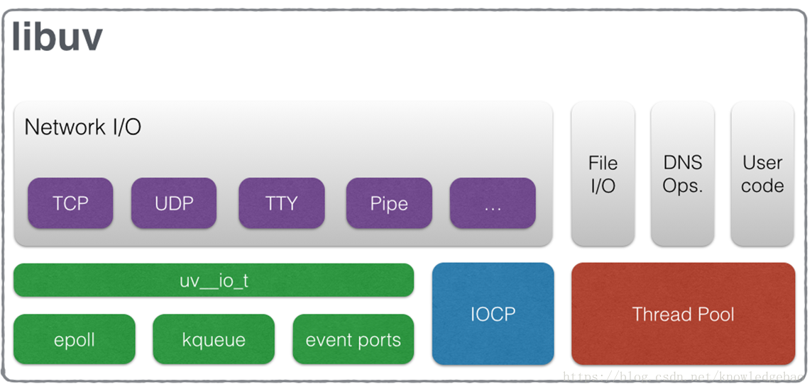
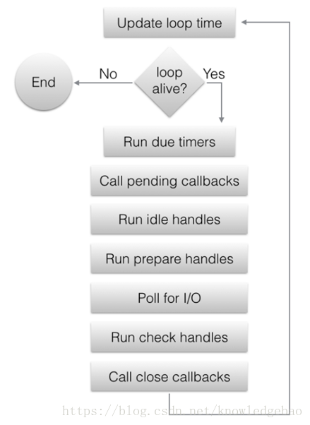

# 1. libuv概述

- [1. libuv概述](#1-libuv概述)
  - [1.1. 简介](#11-简介)
  - [1.2. 编译](#12-编译)
    - [1.2.1. window编译](#121-window编译)
    - [1.2.2. linux编译](#122-linux编译)
  - [1.3. 支持功能](#13-支持功能)
  - [1.4. 架构](#14-架构)
    - [1.4.1. handles and requests](#141-handles-and-requests)
    - [1.4.2. The I/O loop](#142-the-io-loop)
  - [1.5. 参考资料](#15-参考资料)

## 1.1. 简介

&emsp;&emsp;本文基于libuv-v1.22.0进行解释说明，适合于异步调度使用者。要求有C语言基础。

&emsp;&emsp;node.js 最初发起于 2009 年, 是一个可以让 Javascript 代码脱离浏览器的执行环境, libuv 使用了 Google 的 V8 执行引擎 和 Marc Lehmann 的 libev. Node.js 将事件驱动的 I/O 模型与适合该模型的编程语言(Javascript)融合在了一起, 随着 node.js 的日益流行, node.js 的开发者们也意识到应该让 node.js 在 Windows 平台下也能工作, 但是 libev 只能在 Unix 环境下运行. Windows 平台上与 kqueue(FreeBSD) 或者 (e)poll(Linux) 等内核事件通知相应的机制 是 IOCP, libuv 依据不同平台的特性(Unix 平台为 libev, Windows 平台为 IOCP) 给上层应用提供了统一基于 libev API 的抽象, 不过 node-v0.9.0 版本的 libuv 中 libev 的依赖已被移除.

## 1.2. 编译

### 1.2.1. window编译

使用cmake编译,必须安装 `Virsual Studio 2015 Update 3` 或 `Virsual Studio 2017`,部分测试依赖 [Git for Windows](https://git-scm.com/download/win)

```shell
mkdir -p build

(cd build && cmake .. -DBUILD_TESTING=ON) # generate project with tests
cmake --build build                       # add `-j <n>` with cmake >= 3.12

# Run tests:
(cd build && ctest -C Debug --output-on-failure)

# Or manually run tests:
build/uv_run_tests                        # shared library build
build/uv_run_tests_a                      # static library build
```

### 1.2.2. linux编译

使用cmake编译,同 windows 一样，推荐

或者使用autogen那一套

```shell
sh autogen.sh
./configure
make
make check
make install
```

## 1.3. 支持功能

- 事件调度全量支持，包括 epoll, kqueue, IOCP, event ports.
- 异步 TCP, UDP sockets
- 异步 DNS 解决方案
- 异步文件和文件系统操作
- 文件系统事件支持
- 基于 ANSI 的 TTY 终端控制
- 通过 socket 共享，Unix的 domain socket 和 windows 的 pipes 的进程间通信
- 子进程调度
- 线程池
- 信号处理
- 高分辨率时钟
- 线程和同步原语

## 1.4. 架构

&emsp;&emsp;libuv是一个高性能事件驱动库，屏蔽了各种操作系统的差异从而提供了统一的API。libuv严格使用异步、事件驱动的编程风格。其核心工作是提供事件循环及基于 I/O或其他活动事件的回调机制。libuv库包含了诸如计时器、非阻塞网络支持、异步文件系统访问、线程创建、子进程等核心工具。

&emsp;&emsp;libuv有二个主要功能，一个是循环调度模块，也就是异步IO的核心Loop模块，一个是全局的线程池Thread Pool，loop模块主要是用于异步通知，thread pool主要用于线程管理和调度。libuv库里边用到线程池的地方有DNS相关的二个函数getaddrinfo和getnameinfo，文件各种异步操作。其他暂时不使用thread pool，thread pool主要是给调度者使用。

&emsp;&emsp;下图是官网提供的架构图，TCP、UDP、TTY、PIPE等依赖系统的uv__io_t或IOCP异步机制实现异步IO的功能，FILE/DNS/用户代码依赖Thread Pool来实现异步IO机制。

&emsp;&emsp;libuv提供了一个线程池，可用于运行用户代码并在循环线程中得到通知。此线程池在内部用于运行所有文件系统操作，以及getaddrinfo和getnameinfo请求。其默认大小为4，但可以通过将UV_THREADPOOL_SIZE环境变量设置为任何值（最大值为128，putenv("UV_THREADPOOL_SIZE=128")）在启动时更改 。线程池是全局的，并在所有事件循环中共享。当特定函数使用线程池时（即使用时），libuv会预分配并初始化允许的最大线程数。这会导致相对较小的内存开销（128个线程约为1MB），但会增加运行时的线程性能。



### 1.4.1. handles and requests

&emsp;&emsp;loop的调度一般通过二种模式调度，一种是Handle，一种是Request。Handle一般关联一个长期任务，request关联一个一次性任务。比如一个socket的监听任务，就是uv_udp_t（handle）,而一次数据的发送就是一个请求任务，关联请求句柄uv_udp_send_t（request）。

&emsp;&emsp;handle和req每一个变量里边都关联了一个 void* data，用于关联上下文，下图是req和handle的分类。所有的req类型都有一个UV_REQ_FIELDS结构，所以都可以强转为uv_req_t。所有的handle都有一个UV_HANDLE_FIELDS结构，所以都可以强制转化为uv_handle_t.

```C++
#define UV_HANDLE_FIELDS                                                      \
  /* public */                                                                \
  void* data;                                                                 \
  /* read-only */                                                             \
  uv_loop_t* loop;                                                            \
  uv_handle_type type;                                                        \
  /* private */                                                               \
  uv_close_cb close_cb;                                                       \
  void* handle_queue[2];                                                      \
  union {                                                                     \
    int fd;                                                                   \
    void* reserved[4];                                                        \
  } u;                                                                        \
  UV_HANDLE_PRIVATE_FIELDS                                                    \

/* The abstract base class of all handles. */
struct uv_handle_s {
  UV_HANDLE_FIELDS
};

#define UV_REQ_FIELDS                                                         \
  /* public */                                                                \
  void* data;                                                                 \
  /* read-only */                                                             \
  uv_req_type type;                                                           \
  /* private */                                                               \
  void* reserved[6];                                                          \
  UV_REQ_PRIVATE_FIELDS                                                       \

/* Abstract base class of all requests. */
struct uv_req_s {
  UV_REQ_FIELDS
};
```

```c++
/* Handle types. */
typedef struct uv_loop_s uv_loop_t;
typedef struct uv_handle_s uv_handle_t;
typedef struct uv_dir_s uv_dir_t;
typedef struct uv_stream_s uv_stream_t;
typedef struct uv_tcp_s uv_tcp_t;
typedef struct uv_udp_s uv_udp_t;
typedef struct uv_pipe_s uv_pipe_t;
typedef struct uv_tty_s uv_tty_t;
typedef struct uv_poll_s uv_poll_t;
typedef struct uv_timer_s uv_timer_t;
typedef struct uv_prepare_s uv_prepare_t;
typedef struct uv_check_s uv_check_t;
typedef struct uv_idle_s uv_idle_t;
typedef struct uv_async_s uv_async_t;
typedef struct uv_process_s uv_process_t;
typedef struct uv_fs_event_s uv_fs_event_t;
typedef struct uv_fs_poll_s uv_fs_poll_t;
typedef struct uv_signal_s uv_signal_t;

/* Request types. */
typedef struct uv_req_s uv_req_t;
typedef struct uv_getaddrinfo_s uv_getaddrinfo_t;
typedef struct uv_getnameinfo_s uv_getnameinfo_t;
typedef struct uv_shutdown_s uv_shutdown_t;
typedef struct uv_write_s uv_write_t;
typedef struct uv_connect_s uv_connect_t;
typedef struct uv_udp_send_s uv_udp_send_t;
typedef struct uv_fs_s uv_fs_t;
typedef struct uv_work_s uv_work_t;
```

### 1.4.2. The I/O loop

&emsp;&emsp;下图是loop的while循环流程，程序中可以有多个loop，每个loop实际上是一个while死循环，不停的检测各种事件，然后触发各种回调，TCP/UDP/TTY/PIPE等都是while死循环触发的回调，所以回调里边不要干时间太长的事。File I/O,DNS Ops,User cord是线程池触发的回调，可以适当干点长时间的事，具体loop循环，可以定位uv_run，跟进代码详细了解。需要注意的是回调依赖loop的事件，必须执行vu_run函数之后才能触发。因为uv_run是一个死循环，所以会占用独立的线程，此线程只处理loop的事件。tcp或udp的主动触发，需要另外线程去触发。



&emsp;&emsp;事件循环遵循通常的单线程异步 I/O 方法：所有（网络）I/O 在非阻塞套接字上执行，这些套接字使用给定平台上可用的最佳机制进行轮询：Linux上的`epoll`，OSX上的`kqueue`和其他BSD，SunOS上的`event ports`和Windows上的`IOCP`。作为循环迭代的一部分，循环将阻止等待已添加到轮询器中的套接字上的 I/O 活动，并且将触发回调，指示套接字条件（可读，可写的挂断），以便句柄可以读取，写入或执行所需的 I/O 操作。

libuv使用线程池使异步文件 I/O 操作成为可能，但是网络 I/O 始终在单个线程（每个循环的线程）中执行。

```C++
#include <stdio.h>
#include <uv.h>

int64_t counter = 0;

void wait_for_a_while(uv_idle_t* handle) {
    counter++;

    if (counter >= 10e6)
        uv_idle_stop(handle);
}

int main() {
    uv_idle_t idler;

    uv_idle_init(uv_default_loop(), &idler);
    uv_idle_start(&idler, wait_for_a_while);

    printf("Idling...\n");
    uv_run(uv_default_loop(), UV_RUN_DEFAULT);

    uv_loop_close(uv_default_loop());
    return 0;
}
```

## 1.5. 参考资料

1. [code](https://github.com/libuv/libuv)
2. [wiki](http://docs.libuv.org/en/v1.x/)
